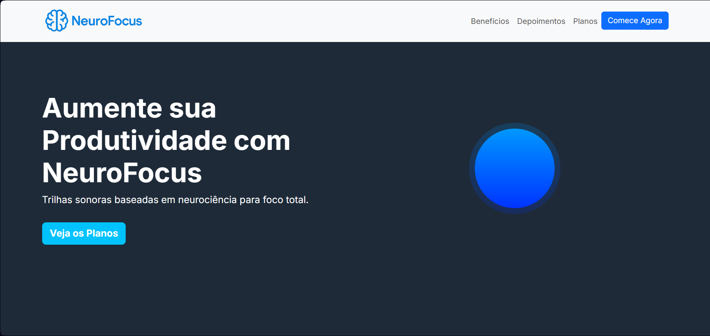
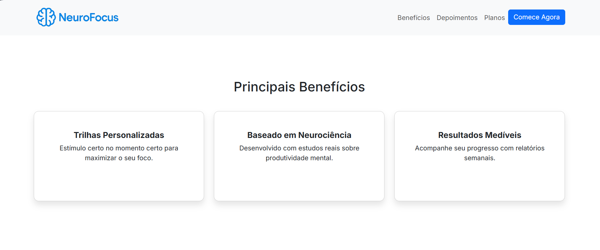
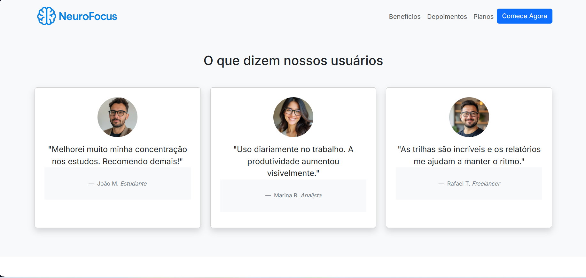
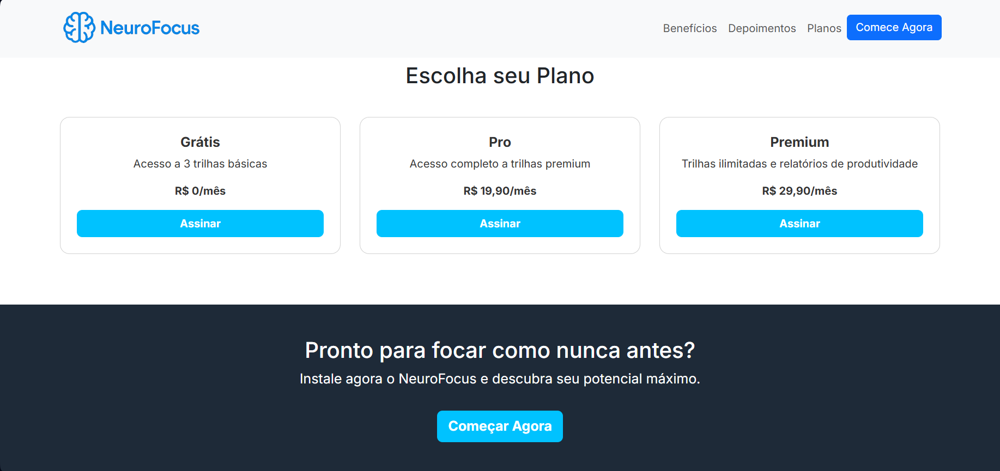

# NeuroFocus - Aumente sua Produtividade

Este projeto é uma **landing page responsiva** criada com **HTML, CSS e Bootstrap 5**, com o objetivo de promover a plataforma **NeuroFocus**, que oferece trilhas sonoras baseadas em neurociência para aumentar a produtividade.

## 💡 Funcionalidades

- Seção Hero com animação Lottie
- Navegação responsiva
- Sessão de Benefícios
- Depoimentos de usuários
- Tabela de planos
- Design moderno e responsivo

## 🧰 Tecnologias Utilizadas

- [HTML5](https://developer.mozilla.org/pt-BR/docs/Web/HTML)
- [CSS3](https://developer.mozilla.org/pt-BR/docs/Web/CSS)
- [Bootstrap 5](https://getbootstrap.com/)
- [Google Fonts - Inter](https://fonts.google.com/specimen/Inter)
- [Lottie Web](https://airbnb.io/lottie/#/)

## 📁 Estrutura de Arquivos
```bash
ObjetivoSistemas/
├── index.html             
├── img/
│   ├── beneficios.png
│   ├── depoimento.png
│   ├── home.png
│   ├── joao.jpg           
│   ├── logo.png           
│   ├── marina.jpg
│   ├── planos.png         
│   └── rafael.jpg         
```

## ▶️ Como Visualizar

1. Clone ou baixe o repositório.
2. Certifique-se de que a pasta `img/` contenha as imagens mencionadas no HTML.
3. Abra o arquivo `index.html` no navegador de sua preferência.

## 📱 Responsividade

O site é totalmente responsivo e se adapta a diferentes tamanhos de tela, desde desktops até smartphones.

## 📸 Prints ou GIFs da Aplicação






## 📌 Observações

- Este projeto é estático (não requer back-end).
- A animação é carregada diretamente de um link do LottieFiles.
- Os botões e seções são funcionais apenas para fins visuais/demonstrativos.

## 📄 Licença

Este projeto é apenas para fins educacionais e demonstrativos. Sinta-se à vontade para utilizá-lo e modificá-lo como quiser.

---

Feito por Douglas Espirito Santo